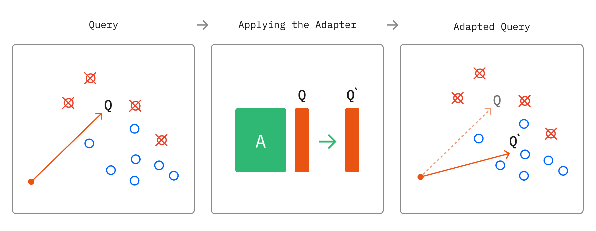

# Linear Adapters
When looking into advanced retrieval methodologies, I stumbled upon the term Linear Adapters, from which I found [this article](https://research.trychroma.com/embedding-adapters) that highlighted its effectiveness in improving retrieval accuracy. As such, this Wiki aims to explain the concept of Linear Adapters, deconflict possible confusion between Linear Adapters and LoRA (Low Rank Adaptation), and explore if it could be used in the use case of our project.

## What are Linear Adapters?

The basic concept is straightforward. Given a set of query embeddings, and a set of relevant and irrelevant document embeddings for each query, we can learn a transform which squeezes and rotates the vector space, mapping them to a new space where the relevant documents are closer to the query. We refer to this transform as an 'adapter', since we apply it after the output of the embedding model itself. This transformation can be as simple as a linear transformation, which can be implemented efficiently as a matrix multiplication.

**TLDR**: Linear Adapters transform query embeddings linearly into 'better query embeddings' closer to the optimal document embeddings.

## Why apply Linear Adapters only to queries?

Of course, these adapters can be applied to the entire document. However, findings from the page (the space is still not well studied) suggest that the model performs better when the adapter is solely applied to the query. In addition, this prevents the need to re-embed all of the documents (which may introduce a large overhead).

## Is there a difference between Linear Adapters and [LoRA](https://arxiv.org/pdf/2106.09685)?

Yes, the two concepts are different. LoRA focuses on reducing the training parameters that need to be fine-tuned during the fine-tuning phase of embedding models. As such, while it is also a method that is focused on fine-tuning, it is implemented during a completely different stage (fine-tuning of embedder model to produce better embeddings) as opposed to Linear Adapters (transformation model that adjusts dense embeddings during retrieval).

## Results of Implementation
We evaluated the Linear Adapters against basic hybrid retrieval, and obtained the following results.

### Corpus used

We used a corpus of 50 Wikipedia pages. The pages are obtained by scraping the Cryptography page of Wikipedia, as well as the links that that page contains.

We took the first 50 in alphabetical order.

### Datasets used

Refer to [Dataset Generation](https://github.com/kangaroojun/rag_dataset_generation) to see in detail how the datasets are generated. In short, chunk(s) are filtered and selected, then query-document pairs are generated based off these (concatenated) chunk(s).

* **Dataset 1: Single-context**
  * Singular chunks were used to generate queries
* **Dataset 2: Multi-context (specific queries)**
  * Multiple chunks were used to generate queries (max 5)
* **Dataset 3: Multi-context (generalised queries)**
  * Queries from Dataset 2 were evolved to be more general.

## Results

### Single-context

| Architecture | Component | top_k | Recall | Mean Reciprocal Rank | Time |
|--------------|-----------|-------|--------|----------------------|------|
| Hybrid | reranker | 5 | 0.987342 | 0.895042 | 11:52 |
| Hybrid | retriever | 5 | 0.987342 | 0.882489 | 11:52 |
| Hybrid | retriever | 25 | 0.993671 | 0.888052 | 11:52 |
| Hybrid + LA | reranker | 5 | 0.987342 | 0.895042 | 10:41 |
| Hybrid + LA | retriever | 5 | 0.987342 | 0.811392 |  |
| Hybrid + LA | retriever | 25 | 0.993671 | 0.888413 | 10:41 |

### Multi-context (specific queries)

| Architecture | Component | top_k | Mean Recall | Fraction of Golden chunks retrieved | Number of hits | Number of golden chunks |
|--------------|-----------|-------|-------------|-------------------------------------|----------------|-------------------------|
| Hybrid | reranker | 5 | 0.651258 | 0.639175 | 124 | 194 |
| Hybrid | retriever | 5 | 0.625472 | 0.618557 | 120 | 194 |
| Hybrid | retriever | 25 | 0.904717 | 0.912371 | 177 | 194 |
| Hybrid + LA | reranker | 5 | 0.670692 | 0.664948 | 129 | 194 |
| Hybrid + LA | retriever | 5 | 0.631324 | 0.634021 | 123 | 194 |
| Hybrid + LA | retriever | 25 | 0.91761 | 0.917526 | 178 | 194 |

### Multi-context (generalised queries)

| Architecture | Component | top_k | Mean Recall | Fraction of Golden chunks retrieved | Number of hits | Number of golden chunks |
|--------------|-----------|-------|-------------|-------------------------------------|----------------|-------------------------|
| Hybrid | reranker | 5 | 0.459748 | 0.438144 | 85 | 194 |
| Hybrid | retriever | 5 | 0.376415 | 0.365979 | 71 | 194 |
| Hybrid | retriever | 25 | 0.740881 | 0.731959 | 142 | 194 |
| Hybrid + LA | reranker | 5 | 0.459748 | 0.438144 | 85 | 194 |
| Hybrid + LA | retriever | 5 | 0.426855 | 0.412371 | 80 | 194 |
| Hybrid + LA | retriever | 25 | 0.75283 | 0.737113 | 143 | 194 |